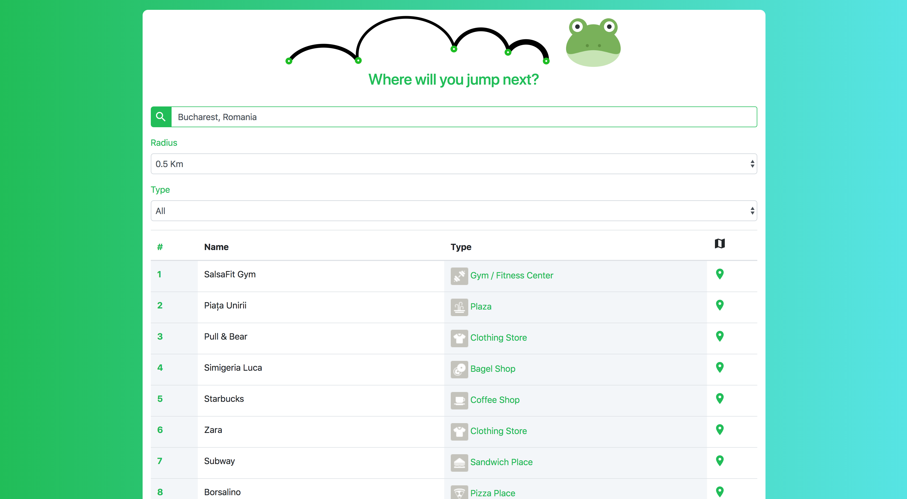
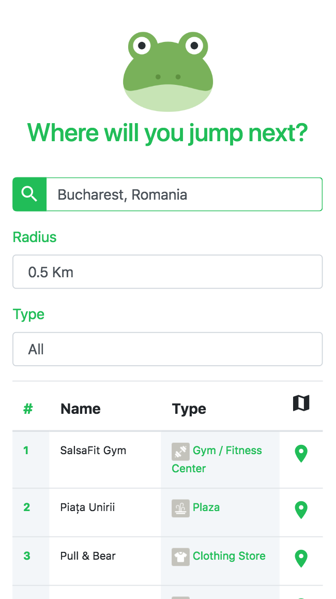

# Entertain Me

### Feature List
* The user enters the website (hosted [here](https://bogdanmatra.github.io)) and is prompted to share his geolocation.
* If the user agrees then the autocomplete placeholder (first input on the page) will be populated with his geolocation name.
* If the user does no agree, the placeholder will show "Choose a place...".
* The user can choose a different place using the Google Maps Autocomplete component.
* The user can change the radius of his search and the types of venues he wants to see.
* When there is no geolocation selected, other filters must be disabled (radius, type).
* Clicking the pin (last column) in the venue list will open the address Google Maps (for some venues the location is not accurate due to the API data).
* While the application is querying the Foursquare API, a loader is shown.

### Application Structure
```
FoursquareConstants     $http     $window     $q
             \            |      /      \    /
            FoursquareAPIService   GeolocationService  $scope
                                 \         |          /
                                    VenuesController
```

Based on the user changes in `venues-filters.html` the `venues-list.html` is updated.

### Tests

* Prerequisites: Install Node.js - https://nodejs.org
* How to run tests: `npm install && npm test`
* Tests documentation: https://code.angularjs.org/1.5.11/docs/guide/unit-testing
* **OBS**: Ony 5 unit tests written for `VenuesController.js` as a proof of concept (see `VenuesController.spec.js`).

* Manually tested on browsers: *Chrome*, *Firefox*, *Safari* on desktop Mac OS X and *Chrome*, *Safari* mobile browsers (Android and iOS).


### Other Technical References

Framework used:
* Angular JS: https://code.angularjs.org/1.5.11/docs/guide

Other 3rd party libraries:
* Bootstrap CSS: https://getbootstrap.com
* Google Maps API: https://cloud.google.com/maps-platform
* Google Maps Autocomplete adapter for Angular JS: https://github.com/jvandemo/angularjs-google-maps
* Loader inspired from: https://www.w3schools.com/howto/howto_css_loader.asp
* Material Design Icons: https://material.io/tools/icons
* Favicon: https://favicon.io/emoji-favicons/frog-face
* SVG created with: https://editor.method.ac

Desktop | Mobile
------------ | -------------
 | 
